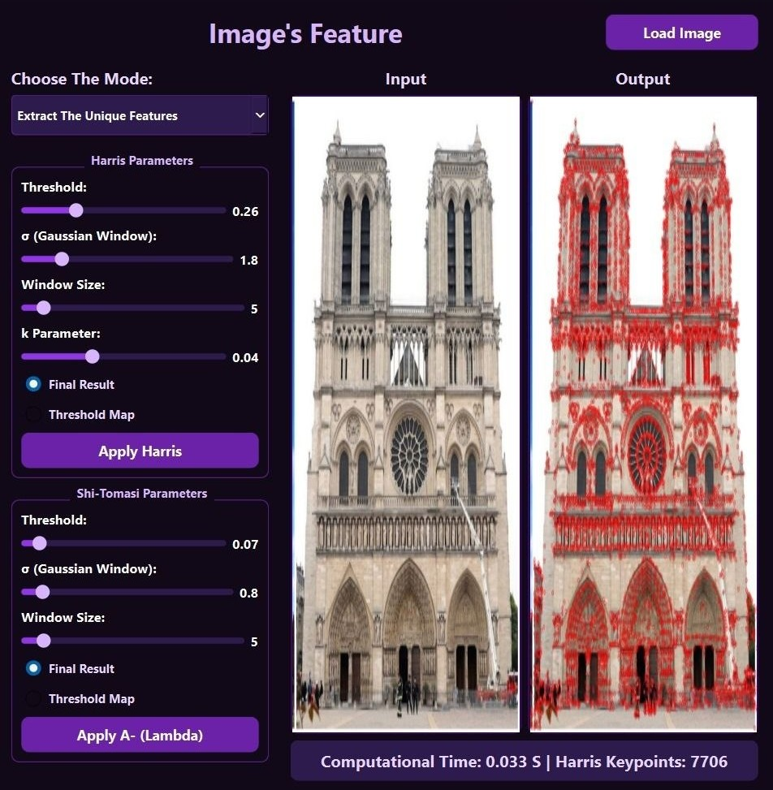
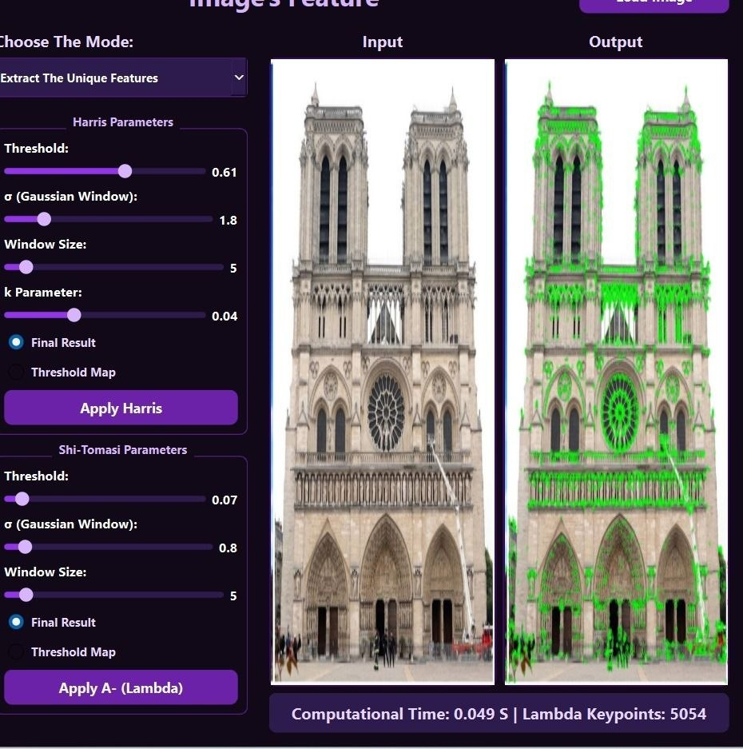
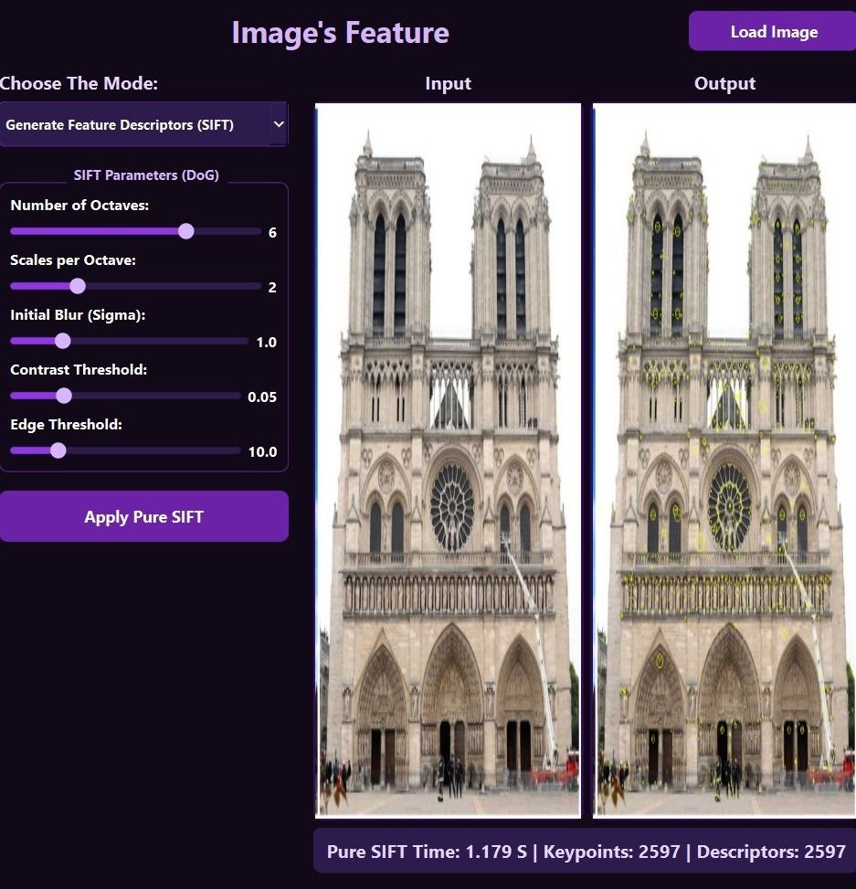

# Corners_and_Feature_Matching_Detection

## 🔍 Images Feature Extractor & Matcher


## 📌 Overview
**Images Feature Extractor** is a robust desktop application designed to explore and apply fundamental Computer Vision algorithms. Built with C++, Qt, and OpenCV, it allows users to detect points of interest, compute invariant descriptors, and accurately match features between different images. 

The project strictly follows mathematical and algorithmic principles, including custom implementations for matching and geometric validation, ensuring high-quality, 1-to-1 feature mapping.

## ✨ Key Features & Capabilities

### 1. Feature Extraction (Corner Detection)
The application identifies distinct keypoints using the structure tensor matrix $M$:
* **Harris Corner Detector:** Calculates the corner response using the determinant and trace: $R = det(M) - k \cdot (trace(M))^2$.
* **Shi-Tomasi (Lambda) Detector:** Computes the minimum eigenvalue ($\lambda_{min}$) of the structure tensor to find more stable corners.
* **Non-Maximum Suppression (NMS):** Ensures only local maxima within a 3x3 neighborhood are selected, preventing overlapping keypoints.
* **Interactive UI Controls:** Real-time sliders to adjust `Threshold`, `Window Size`, `Sigma`, and `k-parameter`.

### 2. SIFT Descriptor Generation
* Utilizes Difference of Gaussians (DoG) for scale and rotation invariance.
* Generates a unique 128-dimensional descriptor vector for each keypoint.
* Adjustable parameters via UI: `Octaves`, `Scales per Octave`, `Initial Sigma`, `Contrast Threshold`, and `Edge Threshold`.

### 3. Advanced Feature Matching
Custom matching functions designed to find the best correspondence between two sets of SIFT descriptors:
* **SSD (Sum of Squared Differences):** Computes the squared Euclidean distance between 128D vectors.
* **NCC (Normalized Cross-Correlation):** Measures cosine similarity, making the matching process highly robust to illumination changes.
* **Lowe's Ratio Test:** Filters out ambiguous matches (e.g., repeating patterns like windows or symmetrical architecture) by ensuring the best match is significantly closer than the second-best match.
* **1-to-1 Match Validation:** A secondary filtering layer that prevents crossed lines and many-to-one matches by keeping only unique index assignments.

## 🧠 Mathematical Core (Under the Hood)
This project translates complex CV mathematics into optimized C++ code:

* **SSD Optimization:** Operates directly on squared distances to save CPU cycles (avoiding costly `std::sqrt` calls), squaring the ratio threshold accordingly: `minSSD < (ratio * ratio) * secondMinSSD`.
* **NCC to Distance Conversion:** To integrate Lowe's Ratio Test natively with NCC (which outputs a similarity score from 0 to 1, where 1 is a perfect match), the application mathematically transforms the correlation score into a distance metric:

```cpp
float best_dist = 1.0f - maxNCC;
float second_best_dist = 1.0f - secondMaxNCC;
if (best_dist < ratio_thresh * second_best_dist) { ... }
```

## 📸 Screenshots

### 🔹 Feature Extraction and SIFT
| Feature Extraction (Harris) | Feature Extraction (Shi-Tomasi) | Feature Detection (SIFT)| 
| :---: | :---: |
| |  |  |


### 🔹 Feature Matching
| Feature Matching (SSD) | Feature Matching (NCC)|
| :---: | :---: |
|  |  |